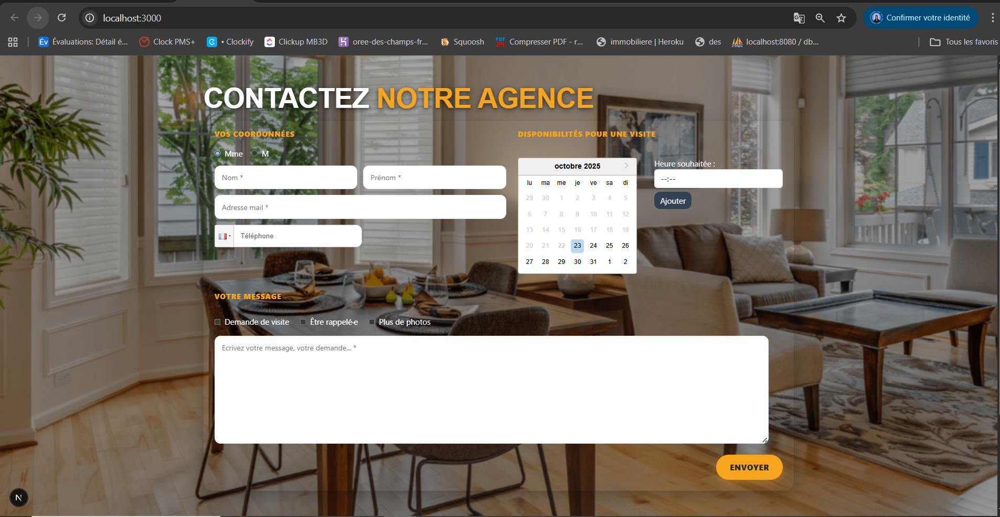
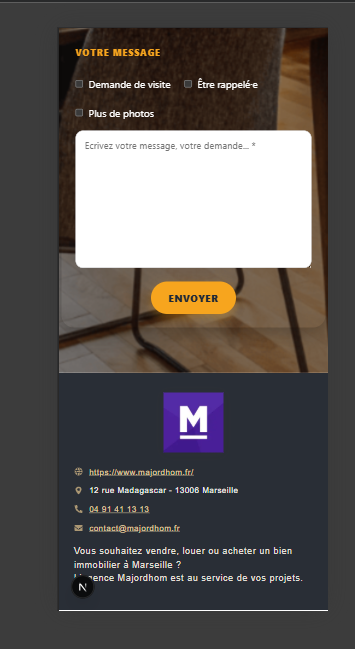
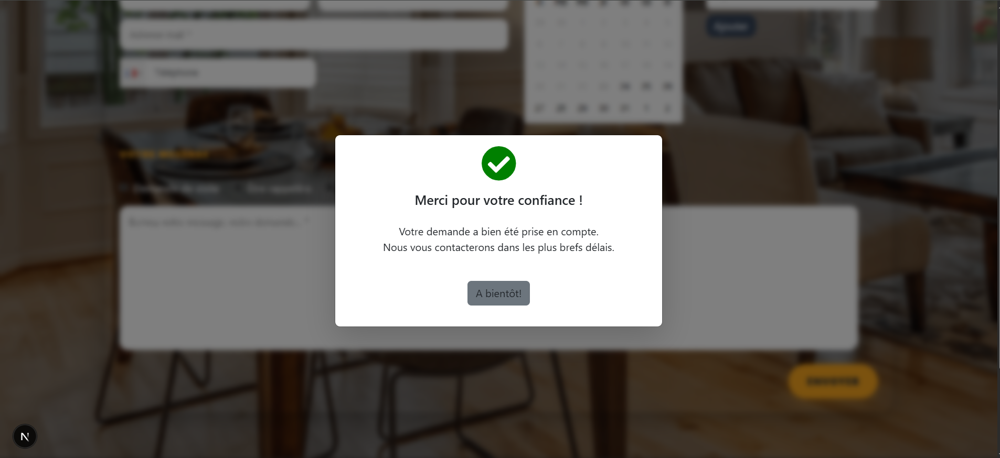
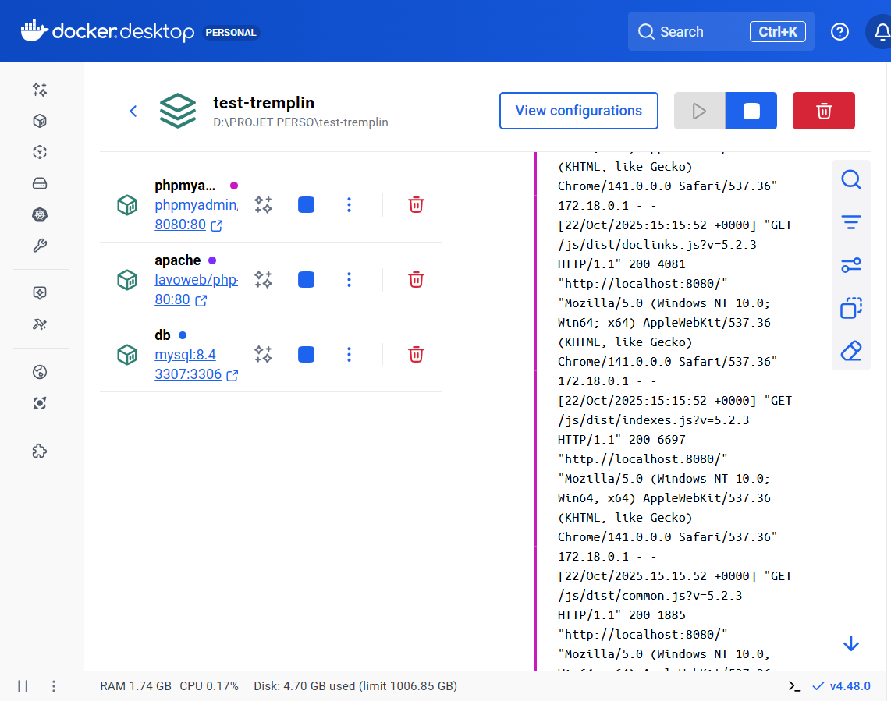

1. Présentations :
    ANDRIAMANOMEMAMY Todisoa Bien Aimée
    Étudiante en Master I d’Architecture Logicielle à l’ESGI – Campus Eductive Aix-en-Provence.
    Je réalise un stage d’une durée de 6 mois.
    Titulaire d'un Master en Génie logiciel et Base de données en 2020 à Madagascar.
    Au cours de mes années d'expériences, j'ai eu l'opportunité de contribuer à la conception, automatisation et développpement d'application web.
    Motivée, curieuse et déterminée, toujours prête à apprendre à me challenger sur des nouveaux défis dans un environnement et équipe dynamique.

2. Captures d'écran de la page crée
    
    
    
    

3. Démarrage de l'environnement :

        - Cloner le projet  : git clone <https://github.com/andriamanomemamy05-a11y/test_templin_todisoa.git>

        - Installer les dépendances : ```npm install```

        - Lancer Docker : ```docker compose up -d```
            * Puis activer les stacks dans Docker Desktop : 

        - Démarrer le projet : ```npm run dev```
            * Ensuite, ouvrir le navigateur à l’adresse : [http://localhost:3000]

        - Accéder à la base de données :
            * Ouvrir PhpMyAdmin : [http://localhost:8080]
            * Nom de la base : majordhom_agence
            * Nom de la table : contact

4. 
    a) Le projet était d’un niveau moyen, il ressemblait à ce que j’ai fait récemment, notamment en développement de sites web, sauf pour la gestion de la base de données et docker qui est différent.

    b) Oui, j’ai appris à utiliser ```react-datepicker``` pour la gestion des sélections de dates, et je redécouvre l’utilisation de Docker et de MySQL.

    c) J’ai choisi React : Next.js car c'est la technologie que j’ai récemment utilisées dans mon dernière entreprise. Elles permettent de développer rapidement des applications performantes, avec un rendu fluide et une grande flexibilité, idéales pour tout type de projet, qu’il soit de petite ou de grande envergure.

    d) Oui je l'ai utilisé, et j’ai également créé ma propre base de données appelée ```majordhom_agence``` dans PhpMyAdmin..
    Je n’utilise pas Docker régulièrement récemment, mais je l’ai déjà utilisé dans mes précédentes expériences professionnelles,et je souhaite vraiement l'approfondir. 